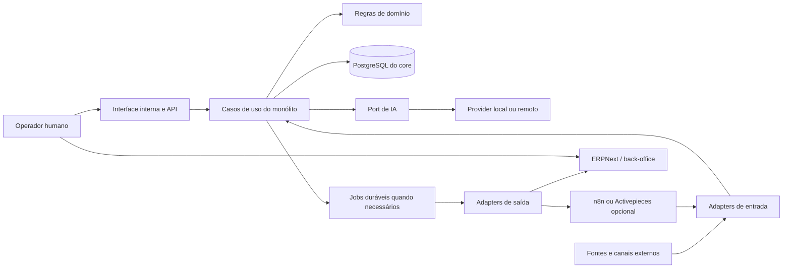

# Architecture Baseline v1

Data: 2026-10-07. Base inspecionada: `main`, commit `84ea22e`.
Status: proposta arquitetural para orientar decisões e implementação incremental.
Não representa features implementadas, aprovação de decisões comerciais ou autorização para deploy/migrations.

## 1. Objetivo e leitura

Operar uma empresa de automação digital: encontrar demanda, vender um escopo executável, entregar, cobrar, sustentar o resultado e demonstrar valor. A própria empresa é o Client 0. A receita inicial vem de serviços e ofertas repetíveis; construir SaaS não é pré-condição para vender.

O destino recomendado é um **monólito modular**, apoiado por sistemas maduros de back-office e adapters substituíveis. ERPNext é o candidato principal de back-office, ainda sem instalação ou integração comprovada neste checkout. O antigo laboratório e bridges não constituem dependências existentes. IoT/home automation está fora do escopo.

Convenções de horizonte usadas em todo o conjunto:

- **N — necessário agora:** decisão ou capacidade mínima para o primeiro ciclo operacional. Pode começar como procedimento humano ou uso do ERP, sem novo código. A implementação ocorre nos gates do roadmap.
- **P — preparado agora, implementado depois:** definir fronteira/contrato; criar código apenas quando um fluxo exigir. Não criar tabelas, serviços vazios ou infraestrutura preventiva.
- **A — adiado:** não necessário ao primeiro ciclo. Reavaliar somente pelo gatilho indicado.

Os demais entregáveis estão em [prioridades e roadmap](delivery-plan-v1.md), [work packages](work-packages-v1.md) e [reconciliação documental](documentation-review-v1.md). Os links relativos partem desta pasta.

## 2. Estado real e evidências

Foram lidos `AGENTS.md`, README, os cinco documentos atuais de `docs/`, todos os módulos de `app/`, testes, migrations, configuração Alembic, Compose, manifesto Python, versões no lockfile, entry point e histórico Git relevante. `.env` real e bancos operacionais não foram consultados. Referências remotas são as já presentes no Git local, sem fetch; não demonstram o estado atual do GitHub.

| Área | Implementado no checkout | Limite observado |
| --- | --- | --- |
| API | `app/main.py` registra quatro routers e `GET /` | Raiz informa processo ativo; não verifica dependências |
| Persistência | SQLAlchemy síncrono; cinco modelos em `app/models.py`; PostgreSQL configurável | Sem fronteira de segurança por tenant; sem repositories/camada de aplicação separada |
| Company | Nome, slug único e data | Sem usuários, memberships, configuração de agente ou integrações |
| Lead | Nome, telefone obrigatório, origem, interesse, status; criação/listagem/consulta/alteração | Sem captura externa, scoring, agenda de ações, histórico de estágios ou entidade Opportunity |
| Customer | Cadastro e conversão de lead; `lead_id` único opcional | Conversão marca `won` diretamente; não exige aprovação/proposta; verificação prévia não resolve todas as corridas |
| Conversation | Exatamente um lead ou customer, da mesma company, validado na criação pela API | Banco não impõe XOR nem correspondência de company nas relações |
| Message | Histórico ordenado por ID; tipos customer/agent/human/system | Não possui company direta; autorização futura deve percorrer Conversation; sem delivery status |
| IA | `app/services/agent.py`, Ollama HTTP síncrono, timeout 120 s, prompt global | Histórico completo sem limite; sem provider port, fila, métricas, avaliação ou config por Company |
| Falha de IA | Mensagem customer commitada antes da chamada; `AgentServiceError` vira 503 genérico | Repetição pode duplicar entrada; testes substituem a função de geração, não exercitam HTTP do adapter |
| Testes | 11 funções em `tests/test_api.py`; SQLite em memória, StaticPool, FK habilitada | Não validam PostgreSQL/Alembic, concorrência, autorização ou integrações reais |
| Execução | Compose sobe somente PostgreSQL 17, porta 5432 publicada e volume local | Não há Dockerfile/API/ERP/worker/proxy/backup/CI de produção versionados |
| Empacotamento | Python 3.12 em `.python-version`, uv, lockfile | `src/business_automation/__init__.py` imprime saudação; não inicia a API; descrição do pacote é placeholder |

Listagens globais e consultas por ID não exigem identidade. Um filtro `company_id` e a validação de vínculo de Conversation são integridade funcional, não autorização. Os canais enumerados em schemas não significam integrações WhatsApp, Instagram, Telegram ou email implementadas.

### Histórico relevante, sem confundir branches com implantação

- `8591af9` criou a suíte inicial; `0be4d77` consolidou persistência da mensagem em falha de IA. Preservar esse contrato.
- `c90943f`, `c445c0d`, `369744b`, `4e16d0b`, `c708ff5`, `4ccfa1e` extraíram schemas, dependência e routers. Preservar a organização mínima, sem reorganização em massa.
- `9e6433d` introduziu produto/roadmap/decisões; `f607cd8` acrescentou consultas de customers e conversations.
- `17b1626` separou core/ERP/lab; `84ea22e` documentou o primeiro fluxo Client 0. As fronteiras são aproveitáveis; a premissa de lab existente foi superada pela orientação atual.
- A referência local `origin/chore/migration-baseline-review` contém `29330b0` (bootstrap de leads), `17a1fe7` (XOR), `c4ca998` (agente por Company), `7d6f3e9` (auth), `1407669` (tenant authorization) e `5900474` (auditoria de memberships). Foram examinados diffs, contratos de auth/dependências e script de validação PostgreSQL. São material de avaliação, não funcionalidades de `main`, nem auditoria de segurança aprovada. Não fazer merge/cherry-pick em bloco.
- `origin/docs/portfolio-positioning` contém `8346742` e `1e1f091`: apresentação como estudo de backend e descrição do pacote. Esse posicionamento não substitui o objetivo operacional/comercial atual. Nenhuma branch foi alterada.

## 3. Visão do sistema e fronteiras

Diagrama de destino incremental; hoje existem apenas API, modelos/banco e chamada Ollama. Cada caixa lógica não corresponde a um serviço deployável.

| Camada | Responsabilidade | Não deve assumir |
| --- | --- | --- |
| Produto/oferta | Problema vendido, resultado, escopo, preço aprovado, suporte e limites | Estrutura interna de banco ou lista de ferramentas como proposta de valor |
| Domínio | Qualificar, decidir elegibilidade, transições, aprovação, políticas de contato | HTTP, detalhes ERP, prompts como fonte de regra |
| Aplicação | Executar casos de uso, autorização, transação local, chamar ports | Reimplementar contabilidade ou esconder efeitos externos em getters |
| Interface | API e interface de operador, validação de entrada e apresentação | Alterar banco diretamente ou duplicar política de aprovação |
| Automação | Executar receita aprovada, agendar, encaminhar notificações | Definir preço, conceder acesso, declarar pagamento ou contrato válido |
| Integrações | Traduzir IDs, contratos, erros e limites de providers | Espalhar DocTypes ou payloads externos por todo o domínio |
| Banco | Persistir estado e integridade transacional local | Ser API pública ou banco compartilhado com ERP/workflows |
| ERP | Documentos comerciais, financeiro e operação administrativa madura | Ser repositório de histórico bruto de prompts/conversas por padrão |
| IA | Extrair, resumir, sugerir e redigir sob limites | Autorizar ações, inventar oferta ou determinar verdade financeira |
| Operação | Deploy, segredos, backup, recuperação, monitoramento e atendimento de incidentes | Depender da memória de uma sessão de agente |

### Organização do código

Manter `app/main.py` mínimo, routers em `app/routers/`, schemas em `app/schemas.py`, dependências em `app/dependencies.py` e integração atual em `app/services/agent.py`. Novos casos de uso podem entrar em `app/services/` por capacidade. Criar `app/integrations/<provider>/` e ports estreitos quando houver a primeira integração. Esses caminhos futuros são sugestões, não diretórios a criar nesta tarefa.

Routers chamam casos de uso; estes aplicam políticas e coordenam SQLAlchemy/adapters. Começar com funções/classes simples e sessão explícita. Não impor framework DDD, repository genérico, mediator, barramento universal ou ORM adicional. Separar modelos/schemas por módulo apenas quando o tamanho e conflitos reais justificarem uma tarefa própria. Adapters não escrevem diretamente nas tabelas de outros contextos; workflows nunca recebem credenciais SQL do core.

Um banco PostgreSQL do core, um artefato da aplicação e, se necessário, um processo worker do mesmo código. ERP mantém sua própria instalação, banco e ciclo de backup. Não compartilhar tabelas/transações com ele.

## 4. Domínios e bounded contexts

Bounded context aqui delimita vocabulário, decisões e ownership; não implica microserviço ou schema separado.

| Contexto | Objetos conceituais | Autoridade e interface | Horizonte |
| --- | --- | --- | --- |
| Identidade e empresa | Company, User, Membership, configuração versionada | Core autoriza ações e seleciona contexto; infraestrutura guarda segredos | N antes de uso operacional da API |
| Aquisição | SourceRecord, Lead, origem, bloqueio de contato | Core decide ingestão/deduplicação; adapter coleta | N manual; P conectores |
| Qualificação e CRM | Assessment, Opportunity, Activity, Customer | Core decide estágio, responsável, próximo passo e perda | N processo; P novas entidades |
| Ofertas e venda | OfferVersion, escopo técnico, referência de proposta e aprovação | Catálogo técnico do negócio; preço/documento formal no ERP | N catálogo pequeno e venda assistida |
| Entrega | Referência de projeto, entregável de automação, aceite técnico | ERP gerencia projeto/tarefas/horas; core acompanha automações e evidência técnica | N execução humana; P sincronização |
| Relacionamento | Conversation, Message, follow-up, referência de chamado, case | Core mantém interação e política de contato; ERP/sistema escolhido mantém ticket | N humano; P canal integrado |
| Financeiro | Referências de fatura, recebimento e vencimento | ERP autoritativo; core apenas projeção operacional | N cobrança; P sincronização |
| Execução de automações | AutomationDefinition, AutomationRun, comando aprovado | Core autoriza e registra; motor executa passos | P primeiro fluxo repetível |
| Integrações | ExternalReference, Handoff, Inbox/Outbox quando necessárias | Core controla entrega/reconciliação; cada externo valida seu domínio | P primeiro efeito externo |
| Assistência de IA | ModelRequest/Result, prompt/version, avaliação | Serviço de aplicação limita contexto e ação; provider gera saída | N preservar fluxo; P desacoplar |

Todos os objetos além dos cinco modelos atuais são conceitos propostos, não compromisso de novas tabelas. Uma checklist privada e um registro no ERP podem satisfazer um contexto inteiro inicialmente.

### Semântica de Company e Customer

`Company` representa o workspace/limite lógico de propriedade do core. No Client 0, a própria empresa de automação é a Company; empresas que compram seus serviços são Customers desse workspace. **Vender um projeto não cria automaticamente outro tenant.**

Se um cliente passa a usar uma instalação/workspace para a própria operação, surge outra Company, com seus próprios leads/customers e credenciais. Um registro comercial do Client 0 não concede acesso ao workspace do cliente. A relação administrativa entre ambos exige concessão explícita e auditada.

`Company` no ERP é a entidade de operação contábil; não presumir equivalência 1:1 com Company do core. Binding explícito por tenant/instância/empresa ERP. Para primeiros clientes, preferir instalações segregadas do mesmo código quando isso reduzir risco; isso não é fork. Compartilhar instalação só depois de provar isolamento.

## 5. Ciclo operacional e catálogo comercial

Fluxo de referência: **origem → triagem → diagnóstico → oportunidade qualificada → proposta revisada → aceite comercial → projeto → entrega/aceite → cobrança/conciliação → suporte → case/recompra**. Nem todo lead vira cliente; nem toda entrega gera case autorizado.

### Catálogo N

Começar com poucas ofertas documentadas, privadas quando contiverem condições comerciais. Famílias candidatas, a validar pelo responsável comercial:

| Oferta candidata | Resultado observável | Entrega mínima | Limite explícito |
| --- | --- | --- | --- |
| Diagnóstico de automação | Processo e ganho esperado identificados | Mapa, baseline de esforço, priorização e proposta | Não promete implementação ou ROI garantido |
| Implantação de fluxo | Uma tarefa repetitiva funciona com tratamento de falha | Integração, testes, instrução e aceite | Sistemas/canais e volume contratados |
| Assistência comercial/CRM | Oportunidades com responsável e próxima ação | Captura/triagem e rotina de follow-up | IA sugere; humano aprova comunicações inicialmente |
| Sustentação de automações | Falhas tratadas e mudanças controladas | Monitoramento, suporte e revisão periódica | Horários, volume e SLA a contratar |

Cada oferta precisa de código/versão, público/problema, pré-requisitos, entradas, entregáveis, exclusões, aceite, esforço/custos estimados, dependências, condições de suporte e responsável. Preço, prazo, margem alvo e contratos são decisões humanas abertas; não preencher com valores inventados. O catálogo técnico pode começar como documento; itens comercializáveis e tabelas de preço ficam no ERP quando adotado. Não construir CPQ/marketplace.

### Captação e lead sourcing N/P

N: captura manual de indicação, formulário ou oportunidade encontrada pelo operador; registrar origem, URL/referência, data, responsável e próxima ação. Selecionar a primeira fonte real antes de construir conector. APIs autorizadas, formulários e importações controladas são candidatos; busca ampla automatizada é A.

P: SourceRecord é evidência de uma oportunidade externa, não cliente e nem autorização de contato. Adapter normaliza payload mínimo; manter referência externa, versão do parser e resultado de triagem. Deduplicar por `(company, source, external_id)` quando existir; similaridade de nome/telefone gera sugestão de merge, nunca fusão destrutiva automática. Um replay não cria outro lead.

Não exigir telefone fictício para fontes que só tenham URL/email: hoje telefone é obrigatório; qualquer ampliação exige schema/migration e revisão próprios. Conteúdo coletado é dado não confiável. Manter proveniência e política de contato; não iniciar scraping indiscriminado ou campanhas automáticas. Retenção, permissões do canal e eventual avaliação jurídica serão definidas para a fonte concreta, sem assumir que dados públicos podem ser usados livremente.

### Qualificação e scoring N/P

N: checklist humana de problema, impacto, acesso aos sistemas, urgência, capacidade de execução e aderência à oferta. Registrar desconhecidos separadamente de respostas negativas. Desqualificação tem motivo; nunca apagar o histórico para melhorar métricas.

P: score determinístico e explicável, com critérios/pesos versionados por empresa e evidências por critério. Uma versão simples pode usar faixas de prioridade; pesos e limiares dependem da validação comercial. IA extrai fatos/sugere classificação com evidência; não declara orçamento ou autoridade não informados. Operador pode corrigir com motivo; mudança de regra não reescreve avaliações passadas. Medir conversão e qualidade, não só volume capturado.

### CRM e pipeline N/P

N: responsável, próxima ação/data e revisão diária das oportunidades abertas, inicialmente em ferramenta/manual se necessário. Preservar os status atuais (`new`, `contacted`, `qualified`, `proposal`, `won`, `lost`) até tarefa explícita de evolução.

P: separar Lead (contato em qualificação), Customer (relacionamento comercial) e Opportunity (uma intenção de compra). Um Customer pode ter várias oportunidades ao longo do tempo. Oportunidade carrega oferta/versão, valor estimado, estágio, responsável, próximo passo, histórico e motivo de perda. Fluxo proposto: descoberta → qualificada → proposta → negociação → ganha/perdida; regras de entrada/saída serão aprovadas por empresa sem motor genérico de workflow.

Hoje `PATCH` permite qualquer status previsto no enum e conversão já marca `won`. Não afirmar que venda foi aceita por existir Customer ou `won`; nenhum documento foi aprovado por esse endpoint. Preservar compatibilidade agora e definir migração de semântica em pacote separado. Conversas de lead continuam vinculadas ao lead após conversão; a timeline futura deve consultá-las via `Customer.lead_id`, sem duplicar mensagens ou preencher ambos os owners.

### Propostas e aprovação N/P

N: redigir escopo a partir da oferta/diagnóstico; humano revisa entregáveis, exclusões, preço, dependências e aceite antes de enviar. ERP é dono da proposta formal quando adotado; core armazena referência e versão do briefing técnico. ERPNext oferece Quotation como documento de venda; o mapeamento e os estados concretos precisam ser validados na versão instalada. [Documentação Quotation](https://docs.frappe.io/erpnext/quotation).

Separar três fatos: aprovação interna para enviar, envio ao destinatário e aceite do cliente. Aceite registra evidência, identidade, data e versão exata; editar escopo/preço após aprovação invalida aquela aprovação. Assinatura eletrônica é integração futura, não feature própria agora. IA nunca aprova desconto ou envia proposta sozinha.

P: comandos estreitos de preparar rascunho, solicitar revisão e registrar referência/aceite. Preço definitivo e impostos vêm do documento formal; uma estimativa do CRM não os substitui. Se ERP não estiver disponível, processo manual com documento controlado e posterior reconciliação; não criar um segundo gerador de documentos fiscais.

### Projetos e execução N/P

N: projeto com escopo aceito, responsável, marcos, acessos necessários, entregáveis, evidência de teste, treinamento, aceite e início de sustentação. ERPNext é o candidato a registro de tarefas/horas/projeto, evitando construir outro gestor. Seu uso em serviços abrange projetos e suporte; a aderência ao fluxo específico ainda exige piloto. [ERPNext para serviços](https://docs.frappe.io/erpnext/erpnext-for-services-organization).

Core guarda somente a relação oportunidade/projeto externo e estado técnico de automações: versão implantada, ambiente, responsável, resultado de execução, runbook e referências de evidência. Documentos e credenciais de acesso ficam em armazenamento privado. Mudança de escopo gera revisão comercial e novo aceite; não modificar silenciosamente a entrega contratada.

N: cobrança conforme condições acordadas, não necessariamente apenas após entrega. Marcos e adiantamentos são possíveis, a decidir por contrato. P: automatizar criação de projeto somente depois de confirmar evidência de aceite e exigências financeiras aplicáveis; falha de handoff não desfaz venda nem cria projeto duplicado.

## 6. ERPNext, ownership e consistência

Esta matriz é a **recomendação de ownership para o piloto**, não prova de ERP instalado. Antes da primeira integração, validar em sandbox a versão, campos obrigatórios, permissões e entidades escolhidas. Se a avaliação mostrar que ERP resolve melhor parte do CRM, mudar ownership por ADR e migração explícita; não manter dois escritores concorrentes.

| Dado | Escritor autoritativo | Cópia/referência permitida | Direção/regra |
| --- | --- | --- | --- |
| Tenant/membership/permissões do core | Core | Binding da conexão ERP | Nunca derivar autorização apenas de ID vindo do ERP |
| Lead bruto, origem, avaliação, pipeline | Core | Referência opcional no ERP | Não sincronizar pipeline completo inicialmente |
| Nome de exibição/contato comercial, preferências de contato | Core | Contato necessário ao handoff | Core → ERP nos campos acordados; mudanças conflitantes pedem revisão |
| Razão social, identificadores fiscais, endereço de faturamento | ERP após cadastro validado | Core pode exibir projeção mínima | ERP → core; não sobrescrever com lead incompleto |
| Oferta técnica/escopo de automação | Catálogo controlado/core | Referência na proposta | Versão técnica acompanha a venda |
| Item, preço comercial, impostos, proposta/pedido formal | ERP | ID, versão e status no core | ERP → core; IA pode sugerir rascunho sem autoridade |
| Projeto, tarefas convencionais, horas | ERP | ID e marcos relevantes | ERP → core; evitar duas listas editáveis |
| Automação implantada e suas execuções | Core | Link no projeto/chamado | Motor reporta execução; core valida resultado |
| Conversas e mensagens | Core | Referência/resumo mínimo autorizado | Não copiar histórico integral ao ERP |
| Ticket e SLA de suporte | ERP ou uma ferramenta única escolhida | Referência e status no core | Um único dono por implantação; decisão antes do uso |
| Fatura, vencimento, recebimento, estorno | ERP | Projeção com data de atualização | Nunca inferir quitação de webhook bruto ou execução bem-sucedida |
| Credenciais | Armazenamento privado de segredos | Referência de segredo no core | Não trafegar em eventos/logs/prompt |
| Métrica de case e autorização de publicação | Processo de relacionamento/core | Artefato privado versionado | Publicação sempre aprovada separadamente |

Customer do core é perfil CRM; Customer do ERP é contraparte de back-office. Vincular por ID estável, não nome/email. Um futuro `ExternalReference` precisa conter Company, conexão/instância, tipo local, ID local, tipo externo e ID externo; impedir colisões entre tenants e entre instalações ERP. Não assumir que DocType Customer, por si só, isola dados por Company do ERP. Permissões e visibilidade do usuário técnico precisam de testes negativos; site/instalação separada é opção inicial conservadora.

### Primeiro handoff proposto P

Caso recomendado: **operador aprova cadastro de contraparte para preparar uma proposta → assegurar referência de Customer no ERP**. É uma proposta de corte, não escolha comercial já resolvida. Contato precisa estar validado; conversão técnica de lead não dispara handoff automaticamente. Não criar Opportunity no ERP por padrão, pois duplicaria o pipeline do core.

Contrato conceitual `ensure_business_party`: contexto de empresa/conexão autorizado, customer local, campos explicitamente permitidos, versão do comando, chave idempotente e correlation ID. Resultado: external reference, estado, horário, categoria de falha e possibilidade de retry. O fake e o adapter real devem respeitar o mesmo contrato. Nomes de DocTypes, campos e URLs vivem no adapter.

A API REST do Frappe fornece acesso a documentos e autenticação; isso não estabelece garantia universal de idempotência para o nosso comando. Validar permissões do usuário de integração e semântica da versão usada. [Frappe REST API](https://docs.frappe.io/framework/user/en/api/rest).

### Falhas e reconciliação

- Commitar intenção local e handoff/outbox na mesma transação, quando houver envio automático durável. Não manter transação SQL aberta durante HTTP.
- Chave estável por empresa, conexão, operação e entidade/versão. Mesma chave/payload devolve o resultado anterior; mesma chave com payload diferente é conflito.
- Antes de repetir criação após timeout, consultar referência externa verificável. Se o remoto não permite deduplicação confiável, marcar resultado `unknown` e reconciliar com operador. Não prometer exactly-once.
- Retry limitado com atraso crescente para indisponibilidade/rate limit; respeitar indicação do provider. Erro de validação, autorização ou mapeamento vai para correção humana, sem loop infinito.
- Projeções exibem `last_synced_at`, estado pendente/falho e link à fonte. Dado vencido não se apresenta como pagamento confirmado.
- Reconciliação periódica/manual compara registros pendentes e documentos remotos, por cursor e janela de sobreposição quando suportados. Atualizações repetidas/fora de ordem não podem regredir estados sem consulta à fonte.
- Excluir/inativar no core não apaga documento financeiro externo. Resoluções de divergência, cancelamentos e reprocessamentos ficam auditados.

## 7. Financeiro e cobrança N

Cobrar serviços é necessário no Client 0. Assinaturas self-service, planos SaaS e medição para cobrança são A. Revisar a decisão histórica “Billing later” nessa distinção.

ERP deve registrar proposta/pedido, contas a receber, vencimentos, recebimentos parciais, inadimplência, despesas e conciliação. Sales Invoice é parte do fluxo de faturamento do ERPNext; não implementar um ledger paralelo no core. [Sales Invoice](https://docs.frappe.io/erpnext/sales-invoice).

Core pode exibir “aguardando faturamento”, “referência emitida”, “vencida”, “recebimento confirmado pela fonte” para orientar trabalho, sempre com atualização da fonte. Lembretes são ações de relacionamento aprovadas e canceláveis após pagamento. Não armazenar dados de cartão. Provider de cobrança, emissão fiscal/localização brasileira, condições de contrato e validação contábil permanecem abertos; esta baseline não certifica conformidade fiscal do ERP.

Rotina inicial: responsável financeiro revisa recebíveis, confirma registro no ERP, confronta divergências e autoriza contatos. Continuidade manual documentada evita parar vendas por indisponibilidade do adapter.

## 8. Atendimento, pós-venda, suporte e cases N/P

N: operador atende, atribui responsável, registra pendência e fecha retorno. Conversa é canal/histórico; chamado é trabalho de suporte com prioridade e resolução. Não usar status de Conversation como substituto de SLA/ticket.

Preferir capacidades de suporte do ERP durante o piloto; adotar outra ferramenta apenas por necessidade comprovada e com um único dono do ticket. P: criar adapter de abertura/consulta de chamado e timeline com referências. Atendimento comercial e incidente técnico têm filas/políticas diferentes, mesmo usando o mesmo canal.

Na entrega: registrar aceite, documentação, contatos autorizados, período/condições de suporte e data de revisão de resultado. Follow-up, renovação e reativação devem consultar bloqueios de contato e não disputar com atendimento humano. Um operador pode pausar automações por empresa/conversa.

Case: capturar baseline de tempo/erro/custo, período observado, resultado, limitações e evidência; separar métricas medidas de estimadas. Solicitar autorização específica para nome, marca, depoimento e dados divulgados. Produzir rascunho anonimizado primeiro; publicar é outra ação, explicitamente aprovada. Não versionar dados reais no repositório público.

## 9. Automações e adapters P

Implementar primeiro uma receita concreta e repetível, por exemplo gerar uma tarefa de follow-up após qualificação aprovada. Core verifica política, destinatário, tenant, permissão, versão e necessidade de revisão. n8n/Activepieces podem executar conectores e passos; não manter uma segunda implementação de elegibilidade/preço/aprovação neles.

Escolher no máximo um motor quando houver fluxo que justifique operação adicional. Até lá, ação humana e função Python atendem. Não instalar os dois, nem construir editor visual ou plataforma de plugins. Avaliar licença, manutenção, segredos e suporte dos conectores no momento da escolha, sem presumir que self-hosted significa uso comercial irrestrito.

Receita versionada: evento de entrada, condições, comando permitido, efeito, política de retry, compensação/manual, proprietário e botão de pausa. Execução: run ID, tenant, definição/versão, causa, tentativas, início/fim, resultado e referência externa. Repetir o mesmo evento não pode enviar novamente a mesma comunicação sem comando explícito.

Adapters de entrada autenticam/verificam origem e normalizam; callbacks não escolhem tenant pelo corpo. Binding de endpoint/credencial determina contexto. Verificar assinatura/replay conforme o canal, limitar payload/taxa e persistir deduplicação antes de confirmar recepção quando o fluxo exigir durabilidade. Adapters de saída usam credencial de escopo mínimo, timeout e erros tipados; schemas externos não vazam como modelos de domínio.

## 10. IA desacoplada N/P/A

N: manter funcionamento e contrato de falha atual. O modelo de execução da API hoje é `qwen3:8b`, por environment. **Pi com Qwen 3.5 9B é o agente de programação futuro**, não decisão de alterar o modelo da API. Nenhuma migração de provider/modelo nesta baseline.

P: port pequeno de geração com mensagens de papéis controlados, contexto permitido, limites, finalidade e referência de configuração. Resultado com texto/estrutura validada e metadados disponíveis (provider/modelo, latência, usage quando houver). Adapter Ollama preserva comportamento; fake determinístico prova que domínio independe do provider. Segundo provider apenas mediante demanda.

Prompt por empresa tem versão; separar política de sistema de conteúdo de usuário/documento. Hoje a API aceita `sender_type=system`, depois mapeado para role system: antes de acesso externo, só operações privilegiadas podem criar conteúdo de sistema. Captura/CRM nunca promove texto externo a instrução confiável.

Para extração, validar schema e referências de evidência; saída inválida é falha recuperável ou revisão humana, não novo fato. Definir limite de mensagens/tokens, tempo, custo e concorrência por empresa. Histórico não cabe indefinidamente no prompt. Remover dados desnecessários e não enviar a provider remoto sem política de dados autorizada. Fallback para humano; troca silenciosa para nuvem pode violar essa política.

Separar geração de envio: resposta gerada pode virar rascunho; um comando de envio passa por autorização e política de contato. Sem execução arbitrária de ferramentas pelo modelo. IA indisponível não bloqueia cadastro, venda manual ou cobrança.

Avaliação P: pequeno conjunto sintético de casos de qualificação/resposta, saída inadequada, dados ausentes, prompt injection e falhas de provider. Medir utilidade/correções humanas e custos; não só qualidade aparente. RAG, banco vetorial, agentes autônomos e roteamento sofisticado são A, condicionados a necessidade e isolamento demonstrados.

## 11. Armazenamento, integridade e transações

N: PostgreSQL como banco operacional do core; SQLite apenas suíte rápida isolada. Migrations são pré-requisito de reprodutibilidade, não executadas por esta análise. Correção da baseline precisa considerar instalações já existentes e revisão explícita; não usar `create_all` em produção nem `stamp` para esconder incompatibilidade.

P: constraints para exatamente um owner de Conversation e consistência de tenant nas relações; estratégias de FK composta/validação devem ser escolhidas em ADR e testadas em PostgreSQL. Unique constraints continuam necessárias mesmo com verificação prévia na API; conflitos concorrentes precisam de rollback e resposta previsível.

Entidades transacionais usam colunas tipadas, relacionamentos e índices conforme consultas reais. JSON serve a metadados variáveis/versionados de adapter, não a preço, tenant, lifecycle ou estado financeiro central. Timestamps em UTC, apresentação no fuso configurado. Valores monetários futuros em decimal com moeda, nunca float.

P: anexos/documentos privados fora do Git, em armazenamento de arquivos com metadados, owner, hash, tipo/tamanho e controle de acesso. Volume privado com backup basta no início; object storage somente por necessidade de acesso/distribuição. Não duplicar anexos ERP por padrão. URLs temporárias/autorizadas quando expostos.

Não criar data lake, event sourcing, réplica de leitura ou Elasticsearch agora. Política de retenção deve distinguir mensagens, candidatos descartados, auditoria, anexos e documentos sujeitos à retenção do sistema autoritativo. Exportação/exclusão deve respeitar vínculo com ERP e backups, com execução humana controlada inicialmente. Duração e obrigações legais exigem decisão específica antes da operação, não defaults universais nesta proposta.

## 12. Jobs, filas e consistência operacional P

No início, manter requests curtos e ações manuais; não usar tarefa em memória como garantia de entrega financeira/comercial. Ao surgir o primeiro efeito externo automático que deve sobreviver a restart, adicionar job durável no PostgreSQL e worker do mesmo monólito. Outbox/intenção fica na transação do caso de uso; não é necessário construir um event bus genérico.

Modelo mínimo proposto: ID, tenant, tipo/versão, chave idempotente, payload mínimo, estado, tentativas, próximo horário, lease/expiração, último erro sanitizado e correlation ID. Estados: pending → running → succeeded; running → retry_wait/failed/unknown. Recuperar lease vencida exige avaliar se houve efeito externo; não repetir cegamente.

Worker faz claim atômico, commit antes da chamada e confirmação após resultado. Concorrência deve ser validada em PostgreSQL descartável. Começar com um worker; escalar por medida de backlog e duração, não antecipação. Agendador pode ser timer/cron chamando comando interno idempotente. Lembretes usam fuso da empresa e checam se ainda são pertinentes antes de enviar.

Reprocessamento exige permissão e preserva tentativa anterior. Limitar tentativas, expor fila de intervenção humana e alertar por idade do item mais antigo. Redis/Celery/RabbitMQ são A até evidência de throughput, isolamento de carga ou recursos que o desenho simples não atenda. Não adicionar mensageria para toda chamada entre módulos.

## 13. Autenticação, autorização e isolamento N

Estado atual é adequado apenas a desenvolvimento controlado com dados sintéticos. Antes de dados operacionais acessíveis pela API, estabelecer acesso privado e identidade/autorização mínimas; antes de exposição pública ou compartilhamento entre clientes, demonstrar isolamento completo. VPN/rede privada reduz superfície, mas não substitui permissão por ação.

Contrato proposto: ator autenticado, membership ativa, Company selecionada e capacidades. Company em path/header/body é apenas seletor validado contra membership; nunca prova de acesso. Usuário técnico de integração tem tenant e escopo fixos, revogáveis. Escolher auth local madura ou identidade externa por ADR; reutilizar branch histórica só após revisão, não construir criptografia própria.

| Papel proposto | Permissões mínimas | Restrições |
| --- | --- | --- |
| Owner | Administrar membros e configuração da própria empresa | Sem acesso implícito a outro tenant |
| Operação/comercial | CRM, conversas, rascunhos e execução autorizada | Não conceder acesso nem confirmar pagamento |
| Aprovador comercial | Aprovar proposta/escopo/condições | Ato explícito auditado; pode ser o mesmo humano no Client 0 |
| Financeiro | Consultar situação e conciliar no sistema autoritativo | Core não edita ledger |
| Leitura | Consultar projeções permitidas | Sem reprocessar, exportar em massa ou acessar segredos por padrão |
| Integração | Comandos específicos, de um binding | Sem administração ou listagens globais |

Não implementar todos os papéis já. Começar com mínimo necessário e uma matriz de ações, evitando booleano `is_admin` que concede tudo em todos os tenants. Bootstrap e recuperação de acesso são operações privadas documentadas, não cadastro aberto.

Toda consulta/mutação, anexo, exportação, job, histórico, callback e cache carrega contexto confiável. Acesso por ID inclui filtro de tenant; recurso de outro tenant retorna ausência sem vazamento. Message herda contexto pela Conversation. Testes negativos devem cobrir IDs adivinhados, tenant adulterado, conta revogada, listagens, vínculos cruzados e ações privilegiadas. RLS é defesa adicional a avaliar para hosting compartilhado; não requisito para um protótipo local nem substituto de testes da aplicação.

## 14. Auditoria, logs e observabilidade N/P

Auditoria registra ação de negócio e autoria: tenant, ator/tipo, ação, entidade, versão/referências, horário, motivo quando aplicável e correlation ID. Priorizar alteração de membership/permissão, aprovação, configuração, envio, reprocessamento e mudança de estado relevante. Gravar com a transação de negócio quando local; efeito remoto é outro evento com referência. Registro de auditoria não deve ser editável pelo fluxo comum; evitar cópia integral de PII/segredos. Proteção imutável externa é P conforme risco, não promessa de inviolabilidade do banco.

Logs técnicos registram erro sanitizado, request/job ID, operação, duração e provider, sem prompts, mensagens, tokens ou payload bruto por padrão. Auditoria não é log de debug. Exportar diagnósticos de forma controlada; retenção e acesso definidos por operação.

N antes do piloto: saúde do processo, conectividade do banco em readiness separada, espaço em disco, sucesso/idade do último backup e runbook de incidente. ERP/LLM indisponível marca funcionalidade degradada, não exige derrubar todo CRM. Não retornar URL/credencial/erro interno no health público.

P com integrações: taxa/latência/erros de API, quantidade/idade de jobs, falhas de sincronização, chamadas IA (tempo, erros, custo disponível) e comunicações pendentes. Começar com logs estruturados e relatório operacional; plataforma completa de métricas/tracing só se a visibilidade simples for insuficiente. Evitar IDs de cliente como labels de alta cardinalidade.

Operador revisa diariamente oportunidades sem próxima ação, entregas bloqueadas, recebíveis vencidos, sincronizações pendentes e tickets; semanalmente avalia conversão, prazo de entrega, horas de retrabalho e margem usando dados financeiros autoritativos. Alertas precisam de destinatário e ação, não apenas dashboard. SLA comercial e disponibilidade alvo permanecem decisões abertas.

## 15. Backups, recuperação e deploy N

Antes de armazenar operação real: definir responsável, destino privado criptografado, credenciais de recuperação separadas, retenção, monitoramento e ensaio de restore. Incluir banco do core, anexos, configuração operacional, segredos recuperáveis por processo separado e backup suportado do ERP. Volume Docker/snapshot isolado não prova recuperação.

Proposta inicial a aprovar: RPO de até 24 h e RTO de até 1 dia útil para piloto interno, cópia diária fora do host e ensaio mensal de restauração. Não são SLA vendido nem garantia existente. Se perder um dia de propostas/pagamentos for inaceitável, ajustar metas e mecanismo antes do uso. Reconciliar ERP/jobs depois de restore, pois relógios de backup e efeitos externos podem divergir.

Restore em ambiente isolado, com rede de saída e jobs/envios desativados; validar registros, anexos, owners e referências antes de reabrir. Nunca testar restore sobre banco real. Registrar duração e evidência, não só código de saída.

Deploy inicial recomendado: um host controlado/VM com API e PostgreSQL privados; ERP em instalação gerenciada separadamente, ainda que no mesmo host com recursos e redes delimitados. LLM local opcional com orçamento de memória/CPU; não permitir que inferência esgote banco/API. A escolha de host/cloud/recursos depende do piloto, sem contratação nesta baseline.

Compose atual é exclusivamente desenvolvimento e publica o banco. Futuro deploy precisa imagem reproduzível com lockfile, usuário sem privilégio, secrets fora do Git, volumes persistentes, política de restart, health/readiness, acesso administrativo e firewall. TLS/proxy quando houver acesso de rede; banco/LLM/ERP técnico não devem ser publicados indiscriminadamente. Não copiar configuração de desenvolvimento para produção.

Release: testes e revisão → artefato identificado → backup validado → janela e migration explicitamente autorizada → smoke test → observação. Rollback de código depende de compatibilidade do schema; downgrade destrutivo não é rollback padrão. Preferir alterações expansivas/compatíveis e plano de recuperação revisado. Esta proposta não autoriza executar release.

A: Kubernetes, multi-região, service mesh, microserviços e alta disponibilidade complexa. Reavaliar quando indisponibilidade/carga/isolamento exigirem e receita suportar o custo operacional.

## 16. Configuração por empresa e core reutilizável

N: distinguir configuração pública/sintética de dados operacionais privados. P: configuração tipada/versionada por Company com ofertas habilitadas, idioma/fuso, horários, políticas de contato/aprovação, prompt aprovado, limites de IA, bindings de canais/ERP e automações habilitadas. Segredos ficam fora; banco guarda referência. Configuração sensível tem auditoria, validação e rollback de versão.

Defaults globais seguros, override explícito por empresa e snapshot da versão utilizada em avaliação/proposta/run. Não permitir Python/SQL arbitrário em JSON, prompt ou workflow como configuração. Mudança de URL/provider exige privilégio e validação de destino para não transformar integração em acesso arbitrário à rede.

| Vai para o core | Vai para configuração privada | Vai para adapter/implantação |
| --- | --- | --- |
| Aprovar antes de enviar, deduplicar, isolar tenant, tratar falha | Oferta, linguagem, horários, critérios e limites aprovados | Credenciais, versão ERP, campos externos, canal, infraestrutura |
| Regras gerais de lifecycle e execução | Template de mensagem e roteiro de atendimento | Tradução de payload, rate limits, autenticação do provider |
| Contrato de evidência/aceite | Critério específico de entrega acordado | Procedimento de instalação do cliente |

Variação que exigir código deve demonstrar necessidade repetível, teste e fronteira clara. Preferir adapter estreito a `if company_id == ...`. Não construir sistema universal de extensões antes de dois usos reais que o justifiquem.

## 17. Riscos e dívida técnica

| Prioridade | Evidência/risco | Tratamento e gate |
| --- | --- | --- |
| P0 | Sem auth; GETs globais/por ID e mutações expostos se servidor for publicado | Bloquear exposição; definir e testar identidade/tenant antes do piloto operacional |
| P0 | Baseline Alembic `7c83...` vazia; `1a2...` altera `leads` sem criação anterior na cadeia de main | Inspeção indica falha em banco vazio; confirmar/reparar somente em tarefa autorizada com PostgreSQL descartável |
| P0 | XOR e vínculos de Company não protegidos integralmente no banco | Revisão de integridade e migrations próprias; testes negativos na API e banco |
| P0 | Falta de ownership formal levaria a dois CRMs/financeiros editáveis | Validar matriz e um único handoff antes de integrar |
| P1 | Conversão marca won sem aceite e status muda sem transição validada | Documentar diferença entre estado técnico e venda; evolução compatível específica |
| P1 | Corridas em slug/conversão; check prévio + commit pode produzir erro não tratado | Testes concorrentes PostgreSQL e tratamento de conflitos localizados |
| P1 | Repetir agent-reply duplica mensagem; histórico/carga sem limite | Pacotes próprios de idempotência e orçamento de contexto; preservar mensagem em falha |
| P1 | Cliente pode declarar mensagem system; mapeamento promove a prompt de sistema | Definir permissão e papéis confiáveis antes de expor canal |
| P1 | Sem response models explícitos, limites de conteúdo/paginação, normalização ou controle de taxa | Contratos estreitos por endpoint; evitar exposição automática de futuros campos sensíveis |
| P1 | Testes mockam função de IA, sem cobertura HTTP do adapter ou conversão completa | Adicionar testes focados, sem calls reais, antes de mudar contratos |
| P1 | Sem integração/jobs/auditoria/backup/restore de produção | Implementar apenas o mínimo exigido pelo primeiro fluxo e gate operacional |
| P1 | ERP ausente e obrigações financeiras/fiscais não validadas | Piloto separado e processo manual controlado; não condicionar receita a integração completa |
| P1 | Histórico fora de main pode ser confundido com trabalho pronto | Inventário/revisão isolados; sem merge integral ou alegação de segurança herdada |
| P2 | Settings e engine instanciados no import; entry point separado não sobe API | Melhorar bootstrap/empacotamento somente quando deploy exigir |
| P2 | Documentação de lab, quantidade de testes e roadmap desatualizada | Reconciliação documental explícita, preservando histórico |
| P2 | Escopo de plataforma engole esforço de vender/entregar | Medir fluxo pago e repetibilidade; adiar módulos sem uso |

Riscos operacionais adicionais: fornecedor muda contrato/canal; credencial revogada; duplicação após timeout; operador não percebe fila parada; indisponibilidade do host local; inferência compete por recursos; proposta gerada promete capacidade não existente. As respostas são adapter testado, reconciliação, alerta acionável, restore ensaiado, limites e aprovação humana, respectivamente.

## 18. Decisões e próximos gates

Manter: core horizontal, Company como raiz lógica, configuração em vez de forks, Client 0 primeiro, preservação de mensagem em falha, isolamento antes de exposição, RAG depois, motor de automação auxiliar, exclusão de IoT e de edição de vídeo como core.

Alterar por decisão registrada: cobrança de serviços é N; billing de SaaS continua A. ERP ownership inclui avaliar propostas/projetos/suporte convencionais, não só contabilidade. Client 0 valida receita/operação antes de self-service. Configuração de agente não precede fundação de acesso e dados. Implantação segregada do mesmo código não viola “sem forks”.

Remover como premissa vigente: lab e bridges existentes, inventário obrigatório do lab, benchmark Dolibarr permanente e promoção automática de artefatos antigos. Não apagar história Git nem migrations. Reclassificar segmentos externos citados nos docs como hipóteses históricas a reconfirmar, não contratos ou prioridades atuais.

Decisões abertas que bloqueiam somente os respectivos pacotes: primeira oferta e fonte, gatilho/campos do handoff ERP, aceites e condição de cobrança, canal/UI mínima, mecanismo de identidade, hosting, orçamento IA, retenção, RPO/RTO e atendimento/SLA. A arquitetura oferece defaults propostos; não inventa respostas comerciais. Cada pacote deve copiar a decisão resolvida de que depende antes de ser entregue ao Pi.

Primeiro resultado a perseguir: **um ciclo Client 0 rastreável, da oportunidade ao recebimento e revisão de resultado, com participação humana e sem criar dados duplicados em core/ERP**. Sua implementação é dividida em gates verificáveis no [roadmap](delivery-plan-v1.md), não em um grande projeto de plataforma.

## 19. Validação desta entrega

Em 2026-10-07: `uv run pytest` passou com **11 testes**, com um aviso de depreciação de Starlette/TestClient sobre httpx. Nenhuma dependência foi alterada para tratar o aviso nesta tarefa documental. `.venv/bin/python -m compileall app tests` e `git diff --check` passaram; os novos Markdown também tiveram links locais, fechamento de blocos e whitespace verificados.

O checkout estava sem `.venv`; uv criou o ambiente para executar a validação. Os testes usaram SQLite em memória conforme `tests/conftest.py`. Não foram executadas migrations, testes PostgreSQL, chamadas Ollama/ERP ou validação de implantação. Logo, o resultado não atesta compatibilidade PostgreSQL, segurança de produção ou integrabilidade do ERP. As conclusões sobre migrations/histórico são de inspeção estática.

Alterações limitadas a quatro documentos novos nesta pasta. Código, configurações, migrations e documentos anteriores permanecem inalterados; sem commit, push, merge ou publicação.
